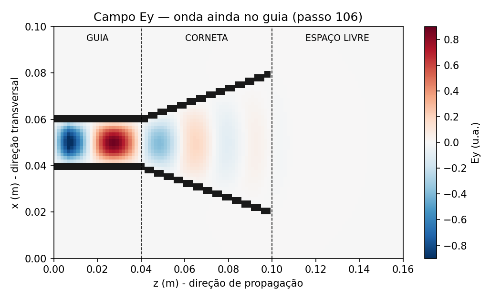
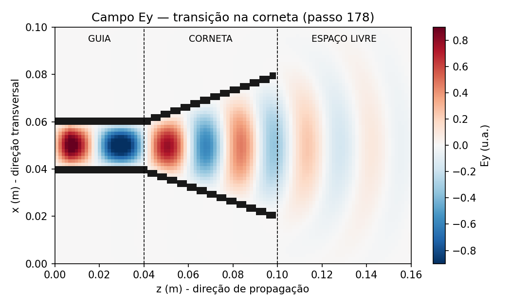
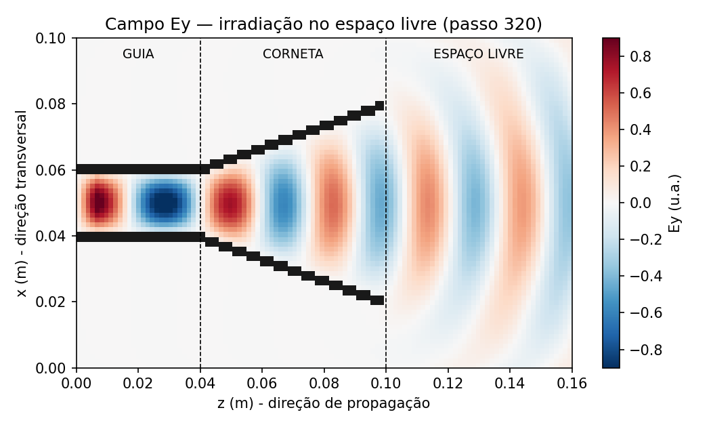
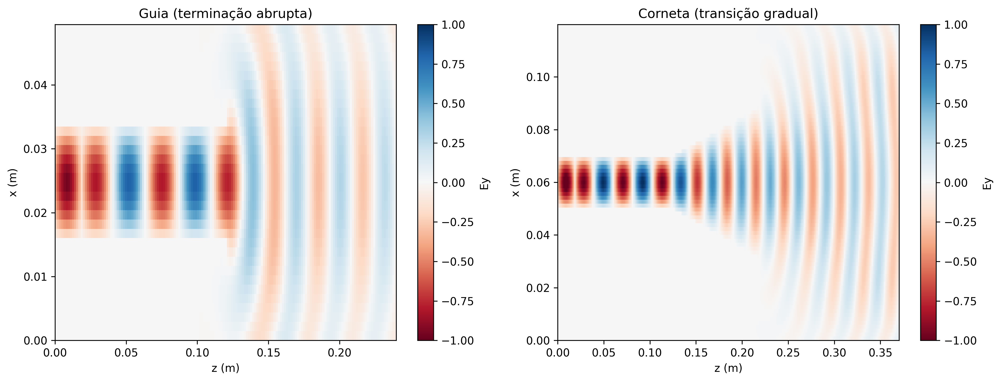
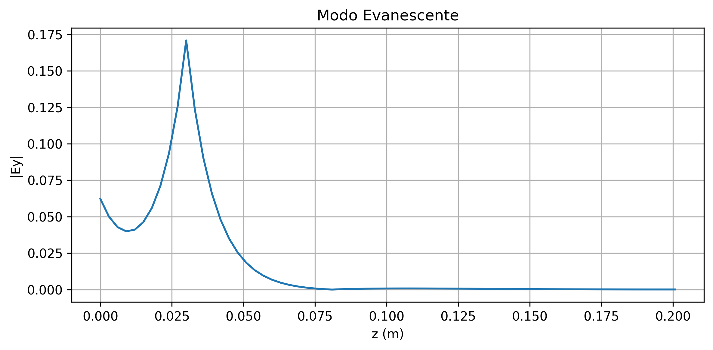

# Relatório — Simulação Computacional FDTD 2D de Guia de Onda e Antena Corneta

Este README documenta o que compõe o relatório exigido para avaliação do *Trabalho Prático: Simulação Computacional de Guias de Onda e Antenas Corneta*, na disciplina de Eletromagnetismo II, da Universidade Federal do Espírito Santo.

## Sumário

- [1. Apresentação Visual](#1-apresentação-visual)
- [2. Análise de Transição](#2-análise-de-transição)
- [3. Estudo de Caso — Modo Evanescente](#3-estudo-de-caso--modo-evanescente)
- [4. Código Fonte](#4-código-fonte)
- [Estrutura do repositório](#estrutura-do-repositório)
- [Como reproduzir os resultados](#como-reproduzir-os-resultados)
- [Parâmetros físicos utilizados](#parâmetros-físicos-utilizados)

---

## 1. Apresentação Visual dos Resultados

Gerados por `main.py`, que produz três figuras estáticas em `output/`:

### Campo no guia



Este frame captura a onda **ainda confinada na seção reta do guia**, antes de atingir a
transição para a corneta. Nele fica evidente o padrão transversal do modo TE10: campo
nulo junto às paredes metálicas (condição PEC, `Ey = 0`) e máximo no centro do guia,
seguindo o perfil `sin(πx/a)`. As frentes de fase constante são aproximadamente **retas
e perpendiculares a z** — ou seja, a onda se comporta como uma **frente de onda plana**
guiada, sem ainda "sentir" a presença da corneta.

### Campo na corneta



Aqui a onda já penetrou na região onde as paredes se abrem progressivamente. Como o
campo continua vinculado às paredes metálicas (que agora divergem), as frentes de fase
constante deixam de ser retas e passam a se **curvar**, acompanhando a abertura da
corneta. Essa curvatura crescente é a assinatura visual da transição de uma onda guiada
(plana) para uma onda que começa a se comportar como radiada (cilíndrica/esférica).

### Campo no espaço livre



Neste instante o regime já está estabelecido e a irradiação no espaço livre é
claramente visível: as frentes de onda aparecem como **arcos concêntricos**,
característicos de uma frente **cilíndrica** (equivalente 2D da frente esférica de uma
antena real em 3D). Essa é a região em que a energia efetivamente se desprende da
estrutura guiada e se propaga livremente, evidenciando o papel da corneta como
transdutor de casamento de impedância entre o guia e o espaço livre.

**Detalhe importante de implementação:** os três instantes de tempo (`n_guia`,
`n_transicao`, `n_livre`) **não são escolhidos arbitrariamente** — são calculados a
partir do tempo físico real de trânsito da onda até cada marco geométrico, usando a
**velocidade de grupo** do modo TE10:

```
vg = c · √(1 − (fc10/f0)²)
```

em vez da velocidade da luz `c`. Isso é essencial porque, dentro do guia, a energia
se propaga a `vg ≈ 66%` de `c` para os parâmetros usados aqui — se o tempo de trânsito
for estimado com `c`, os frames escolhidos ficam adiantados demais e mostram o campo
já em regime estabelecido em todos os três "estágios", em vez de capturar de fato o
guia, a transição e o espaço livre separadamente.

## 2. Análise de Transição

- Dentro do guia, a frente de onda é aproximadamente **plana**, com o perfil
  transversal senoidal do modo TE10 mantido constante ao longo de `z`.
- Ao entrar na corneta, a seção transversal cresce gradualmente (afunilamento
  linear de `a` até `A`), e a frente de onda passa a se curvar, aproximando-se de
  uma **frente cilíndrica/esférica** conforme se aproxima da boca.
- Essa transição gradual — em vez de uma abertura abrupta — funciona como um
  **casamento de impedância**: reduz reflexões na transição guia→espaço livre,
  permitindo que mais energia seja efetivamente irradiada em vez de refletida de
  volta para o guia. A comparação entre a simulação 1 (saída do campo no guia sem corneta) e simulação 2 (saída do campo no guia + corneta) evidencia esse
  efeito.



## 3. Estudo de Caso — Modo Evanescente

Gerado por `prop_modo_evanescente.py`, com `f0 = 5 GHz < fc10 = 7,5 GHz`
(`a = 0,02 m`). O gráfico foi plotado em escala logarítmica ao invés de HeatMap para melhor visualização do campo `|Ey(z)|`. Obtemos como resultado:



Numa onda evanescente pura, o log da amplitude decai **linearmente** com `z` — por
isso a escala log é a evidência visual mais forte de decaimento exponencial
(um trecho reto no gráfico log-linear).

A dedução matemática do modo evanescente é:

1. Dentro do guia, o número de onda longitudinal do modo TE10 é calculado por:
```
kz = √[(ω/c₀)² − (π/a)²]
```

2. Quando a frequência da onda é menor que a frequência de corte (`f < fc10`), o termo dentro da raiz fica negativo, então `kz` é imaginário puro:

```
kz = jα
```
```
α = √[(π/a)² − (ω/c₀)²]     [1/m]
```

3. Isso é o que transforma o campo de "onda viajante" em um campo estacionário que decai:

```
Ey(x,z,t) ∝ sin(πx/a) · e^(−αz) · sin(ωt)
```

## 4. Código Fonte

| Arquivo | Função |
|---|---|
| `SimulacaoFDTD.py` | Classe com o núcleo do método FDTD 2D (grade de Yee, atualização de `Hx`/`Hz`/`Ey`, máscara PEC, fonte TE10, ABC de Mur 1ª ordem) |
| `main.py` | Gera as 3 figuras principais (guia / corneta / espaço livre) com escolha física dos instantes de captura |
| `prop_guia.py` | Caso isolado: propagação em guia reto sem corneta |
| `prop_guia_corneta.py` | Caso isolado: guia + corneta + espaço livre |
| `prop_modo_evanescente.py` | Estudo de caso do modo evanescente (`f0 < fc10`) |
| `guia_x_corneta.py` | Comparação lado a lado: terminação abrupta vs. corneta |

## Como reproduzir os resultados

```bash
pip install numpy matplotlib imageio

python main.py                     # figuras principais (Seção 6.1)
python prop_guia.py           # caso isolado: guia reto
python prop_guia_corneta.py        # caso isolado: guia + corneta
python prop_modo_evanescente.py    # estudo do modo evanescente (Seção 6.3)
python guia_x_corneta.py     # comparação guia vs. corneta
```

## Parâmetros físicos utilizados nas simulações

| Parâmetro | Caso propagante (guia+corneta) | Caso evanescente |
|---|---|---|
| `f0` | 10 GHz | 5 GHz |
| `a` (largura do guia) | 0,02 m | 0,02 m |
| `fc10 = c/(2a)` | 7,5 GHz | 7,5 GHz |
| Condição | `f0 > fc10` → propaga | `f0 < fc10` → evanescente |
| `A` (boca da corneta) | 0,06 m | — |
| Resolução espacial | `λmin/20` (mais fino que o mínimo exigido `λmin/10`) | idem |
| Critério CFL | `Δt = 0,99·Δ/(c√2)` | idem |
| Condição de contorno | PEC nas paredes + ABC de Mur 1ª ordem nas bordas externas | idem |